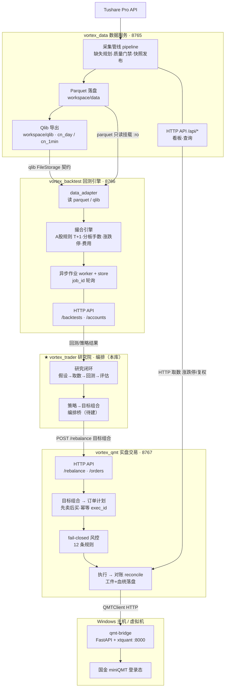

# 01 · 端到端架构

## 全局架构图

> 源文件：[../diagrams/architecture.mermaid](../diagrams/architecture.mermaid)

## 端到端数据流（一次完整链路）

1. **采集**：vortex_data 按调度从 Tushare 拉取行情/财务/事件，经缺失规划去重、质量门禁，落盘为 Hive 分区 Parquet（`workspace/data/<dataset>/date=.../data.parquet`），并更新 SQLite manifest 血统账本。
2. **导出**：抓取空闲时，vortex_data 自动按"水位"增量导出 Qlib FileStorage（`workspace/qlib/cn_day`、`cn_1min`），含复权因子 `factor`、涨跌停、停牌标记。
3. **回测**：vortex_backtest 通过 `data_adapter` 读取数据（当前主路径读 Parquet；Qlib 引擎为待迁移项），按 A 股规则做分钟级订单回放，异步产出日级净值/成交/拒单/指标报告。
4. **研究编排**：vortex_trader 提出假设、调 backtest 评估、择优把策略产出整理为**目标组合**（symbol / target_weight / reference_price）。
5. **实盘执行**：vortex_qmt 收到 `/rebalance` 目标组合 → 生成"先卖后买"订单计划 → 事前 fail-closed 风控 → 经 QMTClient 调 Windows 上的 qmt-bridge → xtquant 下单到 miniQMT → 日终对账。

## 公共契约（服务间的"接缝"）

平台靠三条稳定契约解耦，**改契约比改实现影响大得多**：

| 契约 | 生产方 → 消费方 | 形态 | 关键约定 |
|---|---|---|---|
| **Qlib FileStorage** | data → backtest | `calendars/ instruments/ features/*.bin` | `close` 为 raw 未复权；`factor = adj / 全历史最新 adj`；停牌 `close=NaN` + `paused`；符号 `600000.SH→SH600000` |
| **Parquet 数据集** | data → backtest（只读挂载） | Hive 分区 parquet | 日线 `date=YYYYMMDD`；分钟 `year=/symbol=`；symbol 用 Tushare 内码 |
| **目标组合（target portfolio）** | trader/策略 → qmt | JSON（`POST /rebalance`） | `positions[].{symbol,target_weight,reference_price}` + `st_flags`；权重和 ≤ 1；执行层只消费、不重算信号 |

接口字段级细节见 [02-接口协议汇总.md](02-接口协议汇总.md)。

## 部署拓扑（简）

- vortex_data / vortex_backtest / vortex_qmt 三容器跑在同一 Linux/Mac 宿主机，默认只绑回环（`127.0.0.1`），端口分别为 **8765 / 8766 / 8767**（内外一致）。
- backtest 以**只读**方式挂载 data 的 `workspace`，直接共享 parquet 与 qlib 导出。
- qmt 经 `host.docker.internal:8000` 连接 **Windows 主机**上的 qmt-bridge（xtquant 仅 Windows 可用）。
- 镜像继承链：`python:3.11-slim → vortex-data-base → {vortex-data, vortex-qmt}`；backtest 独立 `python:3.12-slim`。

详见 [03-镜像与部署.md](03-镜像与部署.md) 与 [../diagrams/deployment-topology.mermaid](../diagrams/deployment-topology.mermaid)。

## 集成缺口（本平台当前的薄弱接缝，按优先级）

> 这是端到端视角下最有价值的发现——单看任一服务都不明显，串起来才暴露。

1. **【高】策略 → 实盘没有自动桥**。回测/策略产出与 vortex_qmt 的 `/rebalance` 之间没有任何模块衔接。这正是 vortex_trader 要补的"编排桥"（见 00 定位、04 路线图）。
2. **【中】回测主路径仍读 Parquet 而非 Qlib**。data 已稳定导出 qlib，但 backtest 的 `data_adapter` 主路径走 parquet，Qlib 引擎是待迁移项——两条数据路径并存，契约未完全统一，存在口径漂移风险。
3. **【中】历史跨度过短**。当前 qlib `cn_day` 仅约 100 个交易日（2026-01-05 ~ 06-05），`cn_1min` 仅约 1 个月。难以验证因子/参数的时间稳健性，需先补历史。
4. **【中】基本面数据不全**。已落盘资产负债表、现金流量表；**缺利润表（fundamental）、财务指标（fina_indicator）、业绩预告/快报（forecast/express）**——基本面与多因子方向受限（见 04 数据盘点）。
5. **【低】运行时不一致**：data/qmt 用 Python 3.11，backtest 用 3.12（容器隔离，端口已一号到底互不冲突：8765/8766/8767）。
6. **【安全】data 写接口存在零鉴权 + dataset 名拼 SQL 的注入/路径穿越风险（P0）**；backtest 写接口 token 守卫尚未实现，当前靠"只绑回环"兜底。对外暴露前必须先治理（见 03 安全小节）。

## 成熟度快照

| 服务 | 已跑通 | 主要待办 |
|---|---|---|
| vortex_data | 采集/落盘/质量/磁盘自卫/qlib 导出/看板，79 测试绿 | 安全治理（鉴权+SQL）、补历史与财务数据、管线测试覆盖 |
| vortex_backtest | 真实数据分钟级回测（T+1/手数/涨跌停/费用）、异步作业、看板 | Qlib 引擎迁移、写接口 token、性能（分区裁剪已部分完成） |
| vortex_qmt | paper/dry-run 全链路、风控/对账/幂等、写鉴权+三重门禁 | 接真实 QMT、实盘边界与异常对账、上线 SOP |
| vortex_trader | 调研+契约梳理+数据盘点+本套文档 | 编排桥、研究闭环落地、自动化 |
