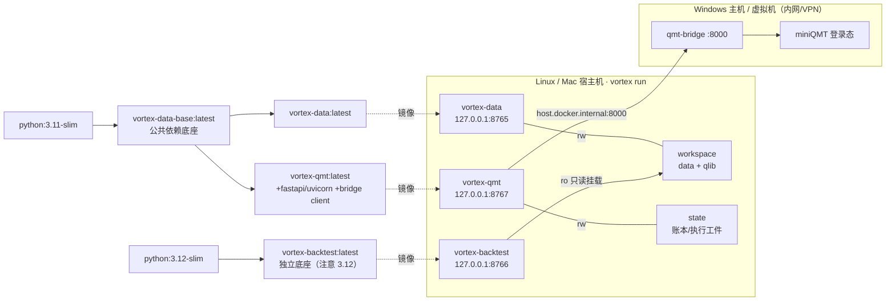

# 03 · 镜像与部署

Vortex 全平台**通过镜像运行**。本文件讲清镜像继承链、端口/卷/环境变量映射、compose 编排顺序、Windows 桥接部署与安全加固。

## 部署拓扑图



> 源文件：[../diagrams/deployment-topology.mermaid](../diagrams/deployment-topology.mermaid)

## 镜像继承链与构建顺序

为避免重复维护依赖底座，data 与 qmt 复用同一个**基础镜像**；backtest 暂独立。

| 镜像 | FROM | 叠加内容 | 构建方式 |
|---|---|---|---|
| `vortex-data-base:latest` | `python:3.11-slim` | base 依赖（pandas/numpy/duckdb/pyarrow/hatchling…） | `vortex image build base` |
| `vortex-data:latest` | `vortex-data-base` | 仅 vortex_data 代码（`pip install --no-deps`） | `vortex image build data` |
| `vortex-qmt:latest` | `vortex-data-base` | `requirements-extra.txt`（fastapi/uvicorn/pydantic）+ qmt-bridge 客户端 + 代码 | `vortex image build qmt` |
| `vortex-backtest:latest` | `python:3.12-slim`（独立） | build-essential + fastapi/pandas/pyarrow + 代码 | `vortex image build backtest` |

**构建顺序（重要）**：

```bash
# 1) 先构建公共基础镜像（data 与 qmt 都依赖它）
vortex image build base        # 产出 vortex-data-base
vortex image build data        # 产出 vortex-data（FROM data-base）

# 2) qmt 需先检出 qmt-bridge 子模块，再构建（FROM data-base）
#    （vortex image build 会自动 git submodule update --init）
vortex image build qmt         # 产出 vortex-qmt

# 3) backtest 独立，可随时构建
vortex image build backtest
```

> `vortex image build` 收编了各仓原 `scripts/build-image.sh` / compose build 调用，依赖底座一次性构齐；`vortex run up <svc>` 在镜像缺失时会按需触发构建。

> ⚠️ **运行时不一致**：data/qmt 为 Python 3.11，backtest 为 3.12。当前各自隔离无碍；若未来 backtest 也并入 data-base（如迁 Qlib 引擎），需统一版本。

## 端口映射

| 服务 | 端口（内外一致） | 默认绑定 | 改对外 |
|---|---|---|---|
| vortex-data | **8765** | `127.0.0.1` | 配 `VORTEX_DATA_DASHBOARD_TOKEN` 后把 `VORTEX_DATA_BIND_ADDR` 设为 `0.0.0.0` 并用 `vortex run up data` 启动 |
| vortex-backtest | **8766** | `127.0.0.1` | 配 token（待实现）后把 `VORTEX_BACKTEST_BIND_ADDR` 设为 `0.0.0.0` 并用 `vortex run up backtest` 启动 |
| vortex-qmt | **8767** | `127.0.0.1` | 配 `VORTEX_QMT_TOKEN` 后把 `VORTEX_QMT_BIND_ADDR` 设为 `0.0.0.0` 并用 `vortex run up qmt` 启动 |
| qmt-bridge（Windows） | 8000 | 内网/VPN | bridge 端 API Key 鉴权 |

> 端口一号到底、容器内外一致（8765 / 8766 / 8767 互不冲突），不再有"容器/宿主"双号映射。compose 端口映射统一写成 `${...BIND_ADDR}:${...PORT}:${...PORT}`（三段同号）。容器内监听恒为 `0.0.0.0`（收 docker 转发），对外暴露只由宿主机侧 `VORTEX_<SVC>_BIND_ADDR` 决定。端口规范权威来源：vortex_common 的 `config/registry.yml` + [ADR-003](../../vortex_common/docs/adr/ADR-003-unified-config-architecture.md)。

## 卷映射

容器内路径恒为 `/workspace`、`/state`（ADR-002）；宿主机根由 `vortex run up <svc>` 自动用 `~/vortex/{workspace,state}` 注入，可用 `VORTEX_*_HOST_ROOT` 覆盖（如 `VORTEX_WORKSPACE_HOST_ROOT`、`VORTEX_STATE_HOST_ROOT`）。

| 服务 | 容器内挂载 | 用途 |
|---|---|---|
| vortex-data | `/workspace`（rw） | 数据、manifest、qlib 导出、日志（持久化真相源） |
| vortex-backtest | `/workspace`（ro）+ `/state`（rw） | **只读**共享 data 的数据；自身账户/订单/作业/报告写 `/state` |
| vortex-qmt | `/state`（rw） | 执行工件：order_plan / pre_trade_result / execution_report / reconcile |

> 整合部署由 `vortex run deploy` 用共享卷串起三服务，backtest 只读挂载 data 的 workspace，宿主机根由 `vortex run` 运行时解析，无相对路径耦合。

## 关键环境变量

> 端口与路径不进服务 `.env`（由 registry.yml 派生、`vortex run` 注入）；服务 `.env` 只放密钥/开关类。绑定地址用 `VORTEX_<SVC>_BIND_ADDR`（默认 `127.0.0.1`）。

**vortex-data**：`TUSHARE_TOKEN`（必填）、`VORTEX_DATA_DASHBOARD_TOKEN`、`VORTEX_DATA_BIND_ADDR`、`TZ=Asia/Shanghai`。

**vortex-backtest**：`VORTEX_WORKSPACE=/workspace`、`VORTEX_STATE=/state`、`VORTEX_BACKTEST_TOKEN`、`VORTEX_BACKTEST_BIND_ADDR`。

**vortex-qmt**（全量透传 `.env`）：
```bash
QMT_BRIDGE_BASE_URL=http://192.168.1.88:8000   # Windows 上 qmt-bridge
QMT_BRIDGE_TOKEN=...        QMT_ACCOUNT_ID=...
VORTEX_QMT_TOKEN=...                            # 写接口鉴权
VORTEX_QMT_ENABLE_TRADING=false                # 实盘总开关（默认关）
VORTEX_QMT_ALLOWED_ACCOUNT_IDS=...             # 实盘账户白名单
VORTEX_QMT_NOTIONAL=1000000  VORTEX_QMT_REQUIRE_ST=true
VORTEX_QMT_MAX_ORDER_COUNT=80
VORTEX_QMT_MAX_SINGLE_ORDER_VALUE=500000
VORTEX_QMT_MAX_DAILY_ORDER_VALUE=2000000
```

## compose 编排（vortex run）

各服务的 compose 由 `vortex run` 统一调度（端口/路径/卷由 registry.yml 派生并在运行时注入；裸 `docker compose up` 会因缺端口必填项报错并导向 `vortex run`）。统一启动流程：

```bash
# 数据（先起，作为真相源）
cp <vortex_data>/.env.example <vortex_data>/.env   # 填 TUSHARE_TOKEN
vortex run up data

# 回测（只读挂载 data workspace）
vortex run up backtest

# 实盘（dry-run 默认安全；实盘另需 Windows 桥接）
cp <vortex_qmt>/.env.example <vortex_qmt>/.env
vortex run up qmt

# 一键拉起全平台（共享卷串起三服务）
vortex run deploy
```

> 宿主机 workspace/state 根由 `vortex run` 用 `~/vortex/{workspace,state}` 注入（可用 `VORTEX_*_HOST_ROOT` 覆盖），共享卷把 data 的 workspace 只读挂给 backtest。`vortex run deploy` 一条命令拉起全平台。

## Windows 桥接部署（实盘必读）

- **为什么需要 Windows**：xtquant / miniQMT / 国金 QMT 仅 Windows 可用且需保持登录态。vortex_qmt 自身平台无关（Mac/Linux/云均可），通过 `QMTClient`（零依赖 stdlib）经 HTTP 连 Windows 上的 qmt-bridge。
- **拓扑**：vortex_qmt 容器 → `host.docker.internal:8000`（compose 已配 `extra_hosts: host.docker.internal:host-gateway`）→ Windows 上 qmt-bridge（FastAPI+xtquant）→ miniQMT。
- **qmt-bridge 来源**：git submodule `external/qmt-bridge`（`scripts/setup-bridge.sh` 检出）；版本由 vortex_qmt pin commit 管理；bridge 的 server 端只在 Windows 跑，不进 vortex_qmt 镜像。
- **网络**：内网/VPN，不暴露公网；防火墙仅放行桥接端口，bridge 端用 API Key 鉴权。

## 安全加固（对外暴露前必做）

1. **默认只绑回环 + fail-closed 写鉴权**是当前安全基线，不要在未配 token 时改 `0.0.0.0`。
2. **vortex_data 的 P0 漏洞**：写接口零鉴权风险 + dataset 名拼 SQL 的注入/路径穿越——**对外暴露前必须先治理**（加 token 守卫 + 参数化/白名单校验 dataset 名）。
3. **vortex_backtest 写接口 token 守卫尚未实现**，当前仅靠只绑回环兜底；联网前补齐。
4. **vortex_qmt 实盘**：Docker 部署必须配 `VORTEX_QMT_TOKEN`（网桥源 IP 非回环）；实盘三重门禁与全局总开关保持默认关闭，多日模拟盘稳定后再人工开启。

## 验证

```bash
curl -s http://127.0.0.1:8765/api/health     # data
curl -s http://127.0.0.1:8766/health         # backtest
curl -s http://127.0.0.1:8767/health         # qmt
```
