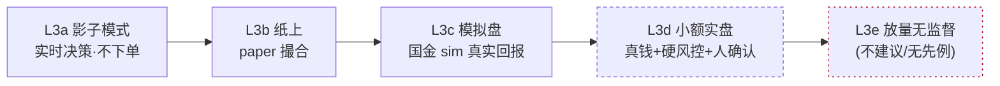

# 05 · L3 自治交易能力阶梯

> 配套 [ADR-001 投资 Agent 架构](../docs/adr/ADR-001-investment-agent-architecture.md)。
> 本文件把"agent 自己在环交易（L3）"从"全有或全无"拆成**可灰度的能力阶梯**：
> 每一级都有明确的**进入门禁**、**可观测指标**、**退出/回滚**，随证据逐级放开。

## 为什么要分级

owner 的目标是 L3（agent 在环决策并下单），并好奇它"能做到什么程度"。诚实的 2026 现状是：
**L3 作为研究/决策引擎很强；作为无监督的真金白银执行引擎，还没有可信先例。** 直接上"agent 全自治放量"既不可治理、证据上也会垮。所以把 L3 拆成五级，每级只多放开一点权限，用证据换信任。

## 三条贯穿原则

1. **验证优先**：每一级升级前，候选必须先过验证脊柱（PIT 防偷看未来 + 真实成本 + 样本外/分段/分板 + A 股精撮合）。
2. **确定性外壳**：agent 永远不直连券商；决策一律经确定性硬风控（复用 vortex_qmt fail-closed 12 规则 + 三重门禁 + 全局总开关 + kill-switch）。决策权在 agent，否决权在代码。
3. **可回放**：agent 的决策策略本身可版本化、可回放——喂同一 `snapshot_id` 必须产出同一目标组合。不可回放者不得升级。

## 能力阶梯总览

| 级别 | 形态 | 用到的服务 | 进入门禁（须全满足） | 现实可达性 |
|---|---|---|---|---|
| **L3a 影子** | agent 实时决策但**不下单**，与基准并行记录 | data + backtest + trader | 决策可回放；离线回测 IC/收益达阈 | ✅ 先建这个 |
| **L3b 纸上** | 决策走 paper 本机撮合 | + qmt(paper) | L3a 累计 N 个交易日决策质量稳定（命中/超额为正、可解释） | ✅ 可做 |
| **L3c 模拟盘** | 接国金模拟盘真实回报 | + qmt(sim) + qmt-bridge | L3b 与回测一致（无结构性偏差）；下单链路过对账 | ✅ 可做（已有 dry-run/sim 通道） |
| **L3d 小额实盘** | 真金白银，硬风控 + 小额 + **人确认** | + qmt 实盘(三重门禁) | L3c 多日稳定；滑点/成交率达标；kill-switch 演练过 | ⚠️ 技术可达，需重护栏 |
| **L3e 放量无监督** | 全自治放量、无人盯 | 全栈 | —— | ❌ 2026 无可信先例，**不建议** |

**结论先行**：现实目标是把 agent 一路养到 **L3d（小额实盘 + 硬风控 + 人在回路确认）**——这已经很强。真正让 owner 省心的是 **L3a–L3c** 段：agent 自己研发 + 影子/纸上/模拟决策，你只在升级到真钱那一步点头。**L3e 维持为禁区**，除非行业出现可信先例。

## 每级详解

### L3a 影子模式（先建）
- **做什么**：agent 每个调仓期产出目标组合，但只记录、不下单；与基准（如沪深300）并行跑"假账"。
- **门禁**：决策契约可回放（同 snapshot 同输出）；离线回测达到预设 IC/年化/回撤阈值。
- **观测**：决策命中率、与基准超额、换手、决策可解释性（每个调仓有理由链）。
- **回滚**：随时停，无真实风险。

### L3b 纸上
- **做什么**：决策走 `qmt` 的 paper 本机撮合，得到完整执行报告与对账。
- **门禁**：L3a 累计 ≥ N 个交易日，决策质量稳定且可解释。
- **观测**：paper 净值、拒单分布（涨跌停/停牌/T+1 是否被正确处理）、对账一致。

### L3c 模拟盘
- **做什么**：经 qmt-bridge 接国金**模拟盘**，拿真实回报与真实撮合摩擦。
- **门禁**：L3b 与回测无结构性偏差；下单/撤单/部分成交/对账链路跑通。
- **观测**：模拟盘 vs 回测的偏移（成交价、滑点、成交率）。

### L3d 小额实盘
- **做什么**：真钱，但**小额** + 确定性硬风控 + 每次下单 owner 人确认（三重门禁）。
- **门禁**：L3c 多交易日稳定；滑点/成交率达标；kill-switch 与异常对账流程**演练过**；单笔/单日/部署上限设定。
- **观测**：实盘 vs 模拟的偏移、风控触发记录、每笔决策的事后归因。
- **回滚**：kill-switch 一键停 + 全局总开关。

### L3e 放量无监督（禁区）
- 维持不开放。2026 没有经独立验证的无监督放量盈利先例；保留"人在回路"为硬上限。

## 横切关注点（每一级都要管）

- **look-ahead 防护**：严格 point-in-time（复用 vortex_data 的 PIT 对齐）；LLM 在环回测警惕语料泄漏，必要时对标的/时间做匿名化盲测。
- **成本建模**：手续费/印花税/过户费/滑点/冲击全计入（复用 backtest 的费用模型与 qmt 的 tick 取整）；越高频越要严。
- **确定性风控**：复用 vortex_qmt 的 12 条 fail-closed 规则 + 三重门禁 + 全局总开关；新增 agent 专用：单次决策最大偏离、最小持有期、最大换手。
- **审计与血统**：每个决策记录 `snapshot_id / run_id / exec_id` + prompt + 工具调用 + 理由链，append-only，可回放复核。
- **记忆与反思**：长短期记忆库 + 按业绩斜率反思（策略在改善还是衰减），用于下一轮决策与因子淘汰。
- **Kill-switch**：独立于 agent 的一键停（人或监控触发），先于一切决策生效。

## 与 vortex 服务映射

| 能力 | 承载 |
|---|---|
| 因子/模型自治研发 | 研究内核（Qlib + RD-Agent，独立镜像/extra）|
| A 股口径精验证 | vortex_backtest |
| 决策/记忆/反思/可回放 | vortex_trader（agent harness，端口 8768）|
| 纸上/模拟/实盘执行 + 硬风控 | vortex_qmt（+ qmt-bridge → Windows miniQMT）|
| 数据与 PIT | vortex_data（Tushare）/ qmt-bridge（xtquant）|

## 升级判据（量化门槛，待 owner 校准）

每级升级前在验证脊柱上须达到（示例阈值，上线前与 owner 定稿）：
- 信息系数 IC、年化收益、最大回撤、Sharpe、换手——分段 + 分板 + 样本外均达标；
- 成本敏感性：费率上浮后仍为正；
- 稳健性：参数邻域非单点最优；
- 一致性：上一级真实环境与回测无结构性偏差。

> 免责：本文件是工程与方法论方案，不构成投资建议或盈利承诺。任何一级上真钱前都须经 owner 校准阈值、过验证与风控。
